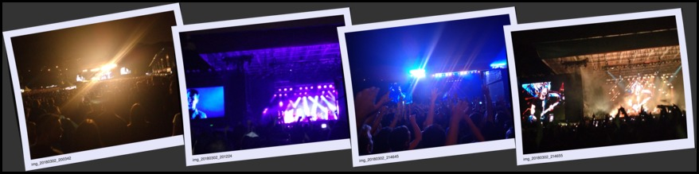

# darth-script
Scripts. Bash, sh, PHP, ... whatever language. Some focused on FreeBSD. Many based on other's scripts.

# Utilities

## graphics/

polaroid.sh		Combine photos, side by side using the ImageMagick polaroid effect. Based on ImageMagick example script.

Example image: 

## sysutils/

vdisk			Mount, unmount and create encrypted disk image to be used as a virtual disk using md (FreeBSD).

## www/

apache-sites	to deploy/undeploy my Directories and Virtual Hosts
